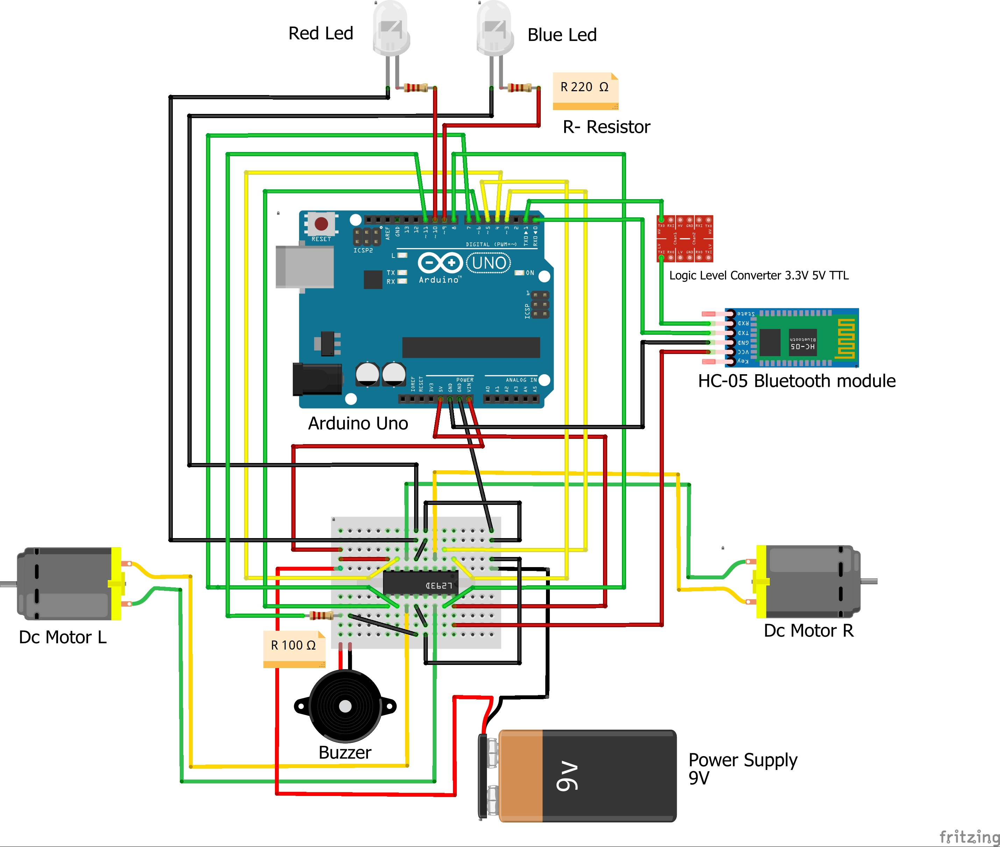
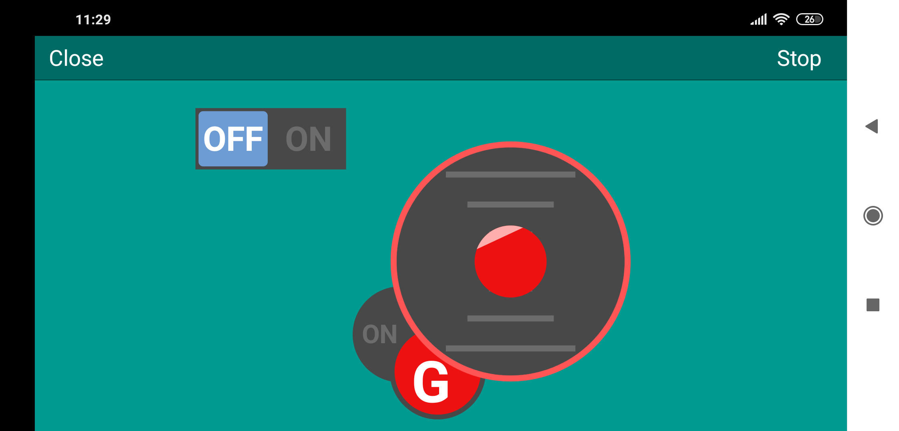

# ArduinoCar_BluetoothControl
---
This is a car made on Arduino Uno, called "*F1*".
---
### Car's Components:
- Arduino Uno
- Driver L293D
- 2 x DC Motors
- HC-05 Bluetooth Module
- Logic Level Converter 3.3V 5V TTL
- Breadboard
- Battery holder 8xAA - 12 V ( I use only 9V, because with 12V the car is too fast)
- 2 x Leds (one red and one blue)
- 3 x Resistors : *100 Ω (for buzzer), 2 x 220 Ω (for Led)*
- Wires
- Buzzer

---
### *Here's the Fritzing Scheme*

---

This car is controled by bluetooth, so that we are able to control it from any device which has a bluetooth. I used an android app, called RemoteXY ( you can easily find it in play market ). In order to create the interface to control F1 using RemoteXY app, I used the following link: *http://remotexy.com/en/editor/*. After customization, it generates a configuration code, which takes care of the graphics part, so now all you have to do is to code the car so the it will work properly. Also, download RemoteXY library and save it into the Arduino library folder. Below you have a screen of my interface using RemoteXY app.

#### Take a look: https://drive.google.com/file/d/1R3Imn-t_oP-hi1OeOc_ysWdGH_Q578sQ/view?usp=sharing
